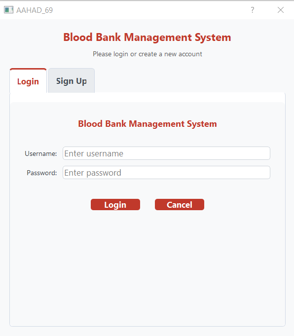
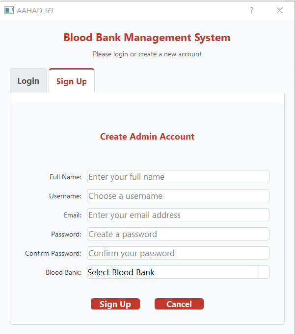
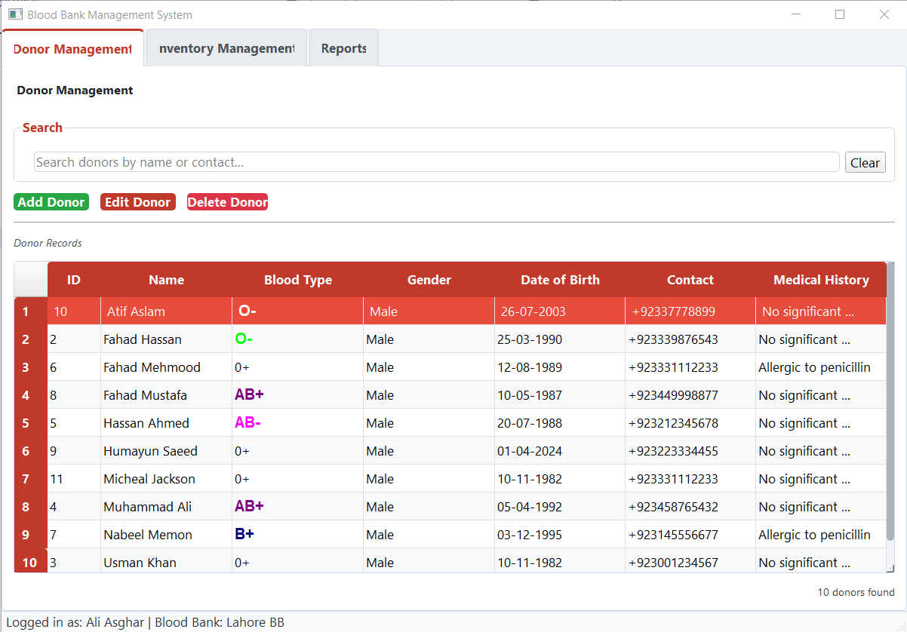
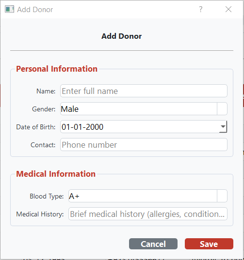
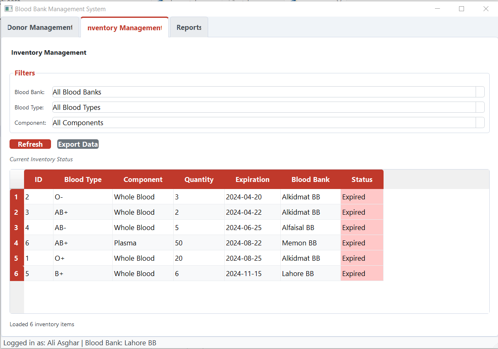
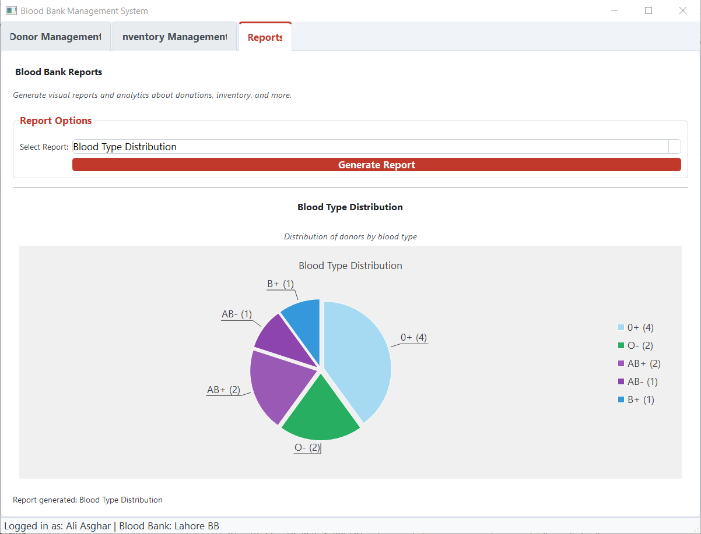
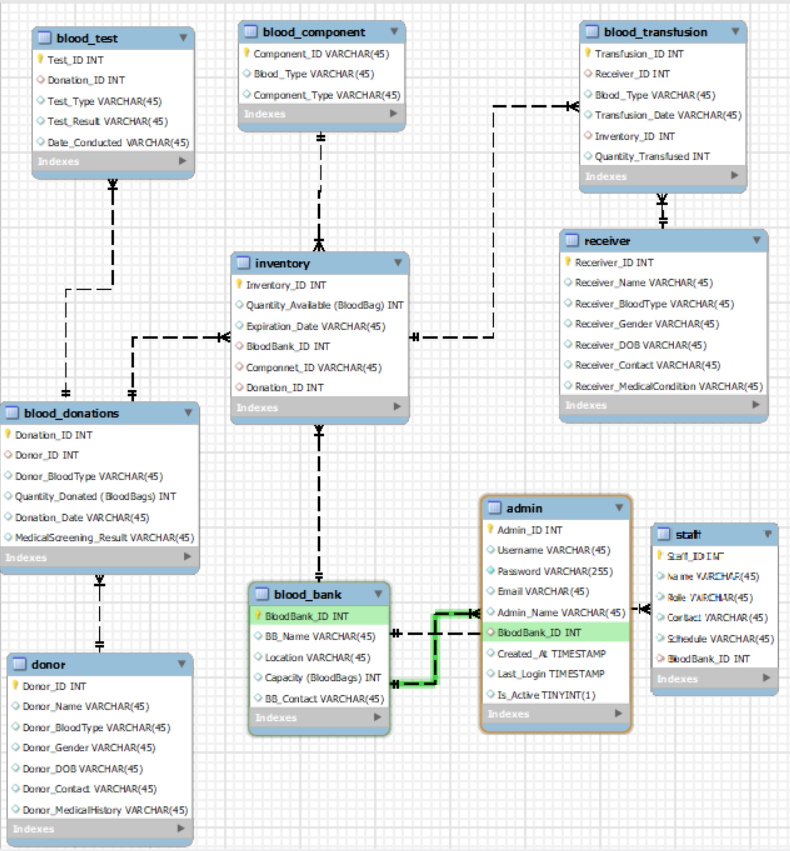

# BloodBank Management System

BloodBank Management System is a PyQt5 desktop application for managing blood bank operations, including donor records, blood inventory, admin authentication, and reports. It was built for the Database Systems course (CSC270).

## Features

- Secure admin login and signup flow
- Donor registration and donor record management
- Blood inventory tracking by blood group and availability
- Reporting views for blood bank operations
- MySQL database-backed storage

## Requirements

- Python 3
- PyQt5
- MySQL Server
- mysql-connector-python

## Setup

1. Create a MySQL database named `bbms`.
2. Import the database schema from `bbms.sql`.
3. Update the MySQL credentials in `database.py` if your local database username or password is different.
4. Install the Python dependencies:

```bash
pip install PyQt5 mysql-connector-python
```

## Run

```bash
python run.py
```

## Screenshots

### Login



### Sign Up



### Donor Tab



### Add Donor Dialog



### Inventory Tab



### Reports Tab



### Database Schema


